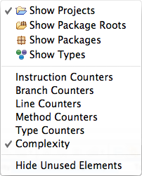

# Test coverage measurement using EclEmma

## Introduction

In this tutorial, you will learn how to use the toolkit EclEmma to measure test coverage.

## Steps

You can follow these steps to use EclEmma to generate test coverage reports.

### **1. Install EclEmma as Eclipse Plugin**

**NOTE**: EclEmma is already in Eclipse 2020-12 by default. You may skip this step.

### **2. Launching in Coverage Mode**

Eclipse allows running Java programs directly from the workbench. Programs can be launched in different so called launch modes. In a standard Eclipse installation you can launch your programs either in Run or in Debug mode. EclEmma adds a new launch mode Coverage which is available from the Run menu and the toolbar:

Existing launch configurations can be launched directly in Coverage mode using default settings. As with the Run and Debug mode you might also select a Java element and launch it directly from the Coverage As context menu. If required, some settings can be modified in the coverage launch dialog:

### **3. View Test Coverage Report**

The Coverage view automatically appears when a new coverage session is added or can manually opened from the Window → Show View menu in the Java category. It shows coverage summaries for the active session.

 

 

 The Coverage view shows all analyzed Java elements within the common Java hierarchy. Individual columns contain the following numbers for the active session, always summarizing the child elements of the respective Java element:

- Coverage ratio
- Items covered
- Items not covered
- Total items

The elements may be sorted in ascending or descending order by clicking the respective column header. Double-clicking an element opens its declaration in an editor with highlighted source code. You can select between different metrics, see last section for details.

 

Some of the actions are deactivated if there is no session or only a single session. More settings are available form the coverage view's drop-down menu:

 

- **Show Elements:** Select Java elements shown as root entries in the coverage tree: Projects, package fragment roots (source folders or libraries), package fragments or types.
- **Counter Mode:** Different counter modes can be selected from the view's drop-down menu: bytecode instructions, branches, lines, methods, types and cyclomatic complexity.
- **Hide Unused Elements:** Filter all elements from the coverage view that have not been executed at all during the coverage session.

### **4. Export Test Coverage Report**

When necessary, you can export the test coverage report. To export the report, right click the entry in `Coverage Report` and select `Export Session`

