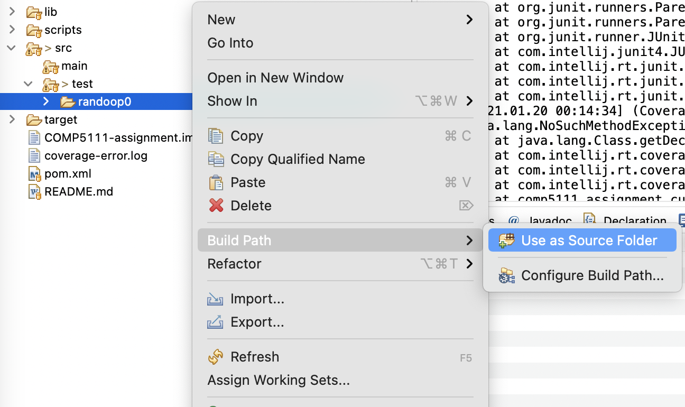
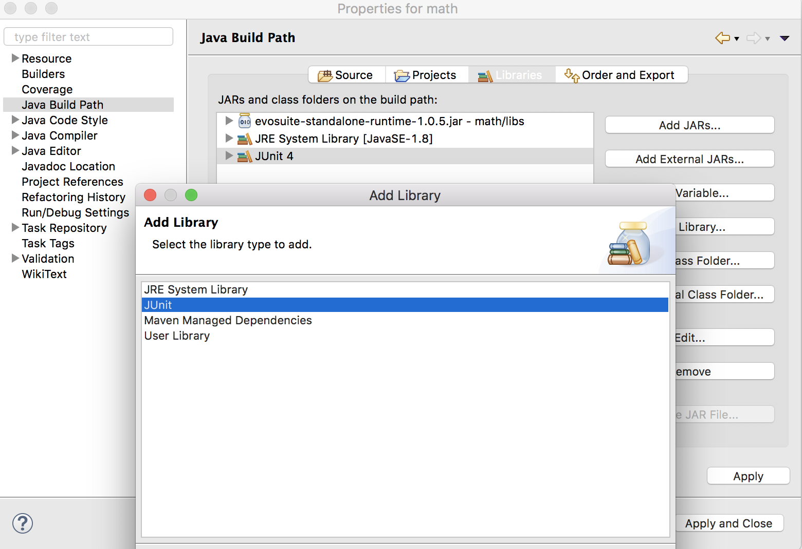
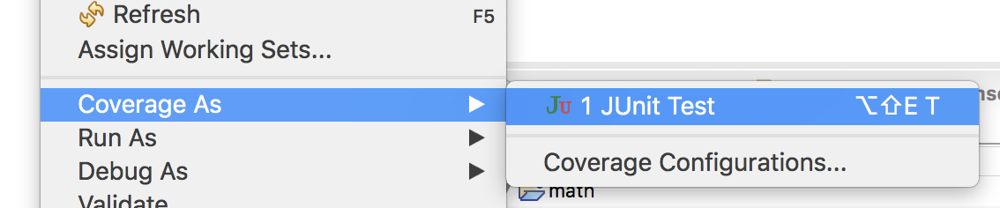

# Random Testing with Randoop

 

## Introduction

In this tutorial, you will learn how to use the random testing tool Randoop. Randoop is an automatic unit test generator for Java programs. 

 

## Steps

You can follow these steps to use Randoop to generate test cases.

 

### **1. Install Randoop**

 

Randoop is a command line tool written in Java. To install Randoop, please refer to the [official guide of Randoop](https://randoop.github.io/randoop/manual/#getting_randoop).

Please Note the subtle differences to set environment variables on Windows and Unix-based systems.

 

### **2. Generate Test Cases**

 

After setting up the environment for Randoop, generating junit test cases is as easy as a single line of command.

First of all, you need to download assignment 1 project, make sure the 
file`src/main/java/comp5111/assignment/cut/ToolBox.java` exists.

Then, you need to compile the `ToolBox` class. (You SHOULD know how to compile java source code.)
Suppose the root dir of the project is ${ROOT_DIR}, and the folder containing the java bytecode is `${TARGET}`, whose 
content 
should have `${TARGET}/comp5111/assignment/cut/ToolBox.class` file available.

To use Randoop to generate test cases for our class under test, you can use the following command:

Linux and MacOs version (bash): 
```
java -ea -classpath ${RANDOOP_JAR}:${TARGET}/ \
   randoop.main.Main gentests \
   --testclass=comp5111.assignment.cut.ToolBox \
   --time-limit=60 \
   --junit-package-name=comp5111.assignment.cut \
   --junit-output-dir=${ROOT_DIR}/src/test/randoop0
```

Windows version:

```
java -ea -classpath %RANDOOP_JAR%;%TARGET%/ randoop.main.Main gentests --testclass=comp5111.assignment.cut.ToolBox --time-limit=60 --junit-package-name=comp5111.assignment.cut --junit-output-dir=%ROOT_DIR%/src/test/randoop0
```

Note: The randoop parameters used in the command

`gentest`: Generate test using Randoop

`--testclass`: The class under test

`--timelimit`: The time limit for test case generation (in seconds)

`--junit-package-name`: The package name of the generated test cases

`--junit-output-dir`: The output directory name of the generated test cases

You can customize your own options when running Randoop. More options could be found on [Randoop Manual](https://randoop.github.io/randoop/manual/#customize). 
You can use the given parameters or use your customized parameters. However, the generated test cases should be able to cover most statements/branches.

Please note that all the test cases you generate should be located in `${ROOT_DIR}/src/test` folder.

### **3. View and Run the Generated Test Cases**

After the previous step, there should be test cases generated in the specified output directory (“test” in the example).

To run the tests from Eclipse, you need to:

1. Add folder containing randoop generated test suite (e.g. `randoop0`) to the **Build Path**



2. Add JUnit 4 to the **project dependencies**

   a.     Right click the project

   b.     Select *Properties*

   c.     Select *Java Build Path*

   d.     Select *Libraries*

   e.     Click *Add Library…*

   f.      Select *JUnit*

   g.     Select *JUnit 4*





3. **Run** the generated test cases and measure the coverage

   a.     Right click the test suite class generated by Randoop

   b.     Select *Coverage as* ® *JUnit Test*

 

 

 
